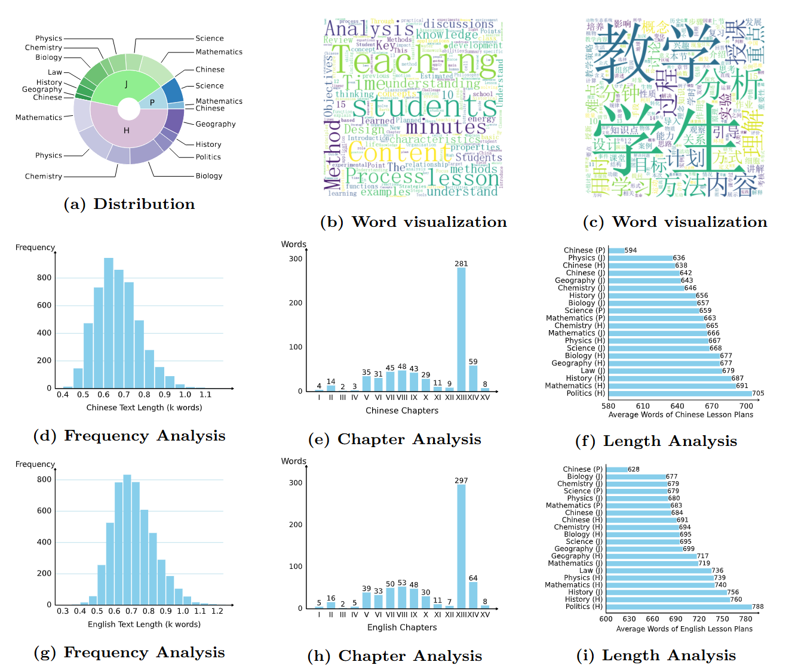
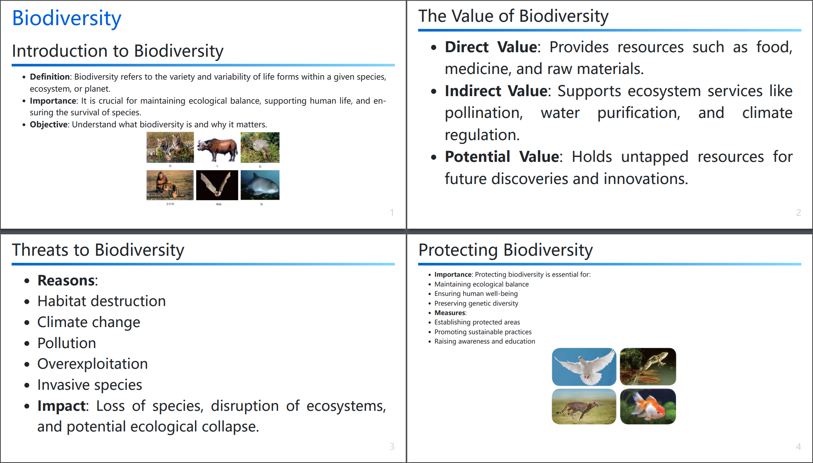
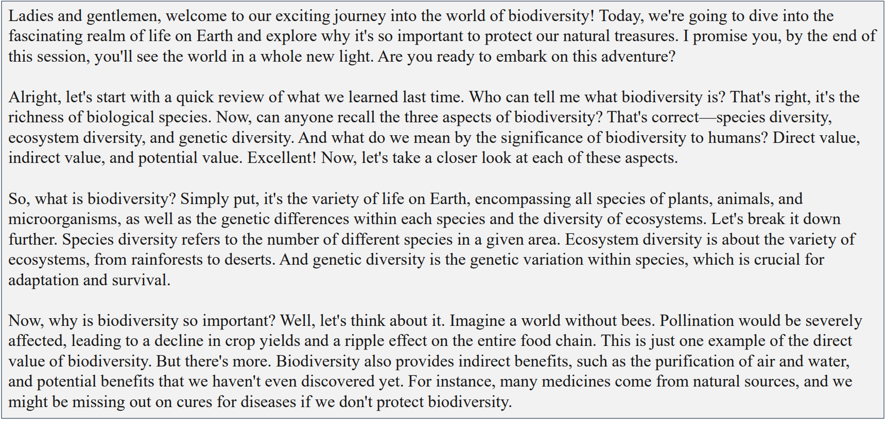

# LANG: A Lesson Plan Generation Framework via Multi-Form Interaction with Large Language Models

## Dataset

### Statistics

#### Distribution

Distribution chart of lesson plans across different educational stages and subjects:

<div style="text-align: center;">
  
</div>

#### Quality analysis

Quality analysis of our Plan10k. "P" denotes primary school, "J" denotes junior high school, and "H" denotes high school.

<div style="text-align: center;">
  
</div>

### Visualization of lesson plan.

<div style="text-align: center; display: flex; align-content: flex-start;">
  
  
</div>


#### Visualization of presentation generation.
Here are the slides for the lesson on “Biodiversity”.

<div style="text-align: center;">
  
</div>

#### Visualization of podcast.
Here is an excerpt of podcast content for the lesson on “Biodiversity”.

<div style="text-align: center;">
  
</div>


### Access

Our dataset samples are available in the [dataset](dataset) directory. The samples are in JSON format and can be accessed as follows:

```python
import json
samples = json.load(open('dataset/en-samples-10.json', encoding='utf-8'))
```

### Dataset Details

Each data entry includes `id`, `language`, `query`, `input` and `output`. The `query` refers to the teacher's inquiry (knowledge point), the `input` is the prompt provided to the LLMs, and the `output` is a complete lesson plan.

```json
{
    "id": "01",
    "language": "en",
    "query": "...",
    "input": "...",
    "output": "..."
}
```

## Comparing

Comparison of chapter correction before and after based on GPT Score:

<div style="text-align: center;">
  
</div>

Teacher satisfaction:

<div style="text-align: center;">
  
  
</div>

## Demo
The following is a complete set of lesson plan, presentation, and podcast.

||en|zh|
|:-----|:-----:|:-----:|
|plan|[view](files/plan%20en.pdf)|[view](files/plan%20zh.pdf)|
|presentation|[view](files/ppt%20en.pdf)|[view](files/ppt%20zh.pdf)|
|podcast|[download](files/podcast%20en.wav?raw=True)|[download](files/podcast%20zh.wav?raw=True)|
