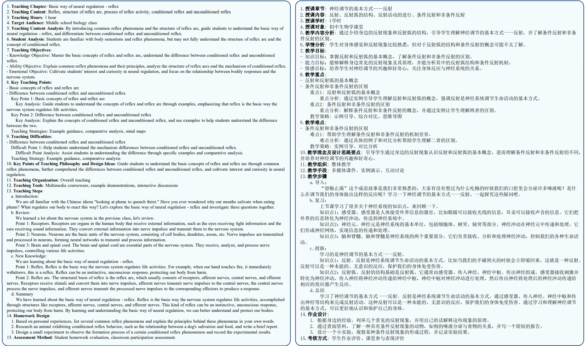

# LANG: A Lesson Plan Generation Framework via Multi-Form Interaction with Large Language Models

## Dataset Examples

### Access

Our dataset samples are available in the [dataset](dataset) directory. The samples are in JSON format and can be accessed as follows:

```python
import json
samples = json.load(open('dataset/en-samples-10.json', encoding='utf-8'))
```

### Dataset Details

Each data entry includes `id`, `language`, `query`, `input` and `output`. The `query` refers to the user's inquiry (knowledge point), the `input` is the prompt provided to the LLMs, and the `output` is a complete lesson plan.

```json
[
    {
        "id": "01",
        "language": "en",
        "query": "...",
        "input": "...",
        "output": "..."
    },
    ...
]
```

### Lesson Plan Showcase

<div style="text-align: center;">
  
</div>
